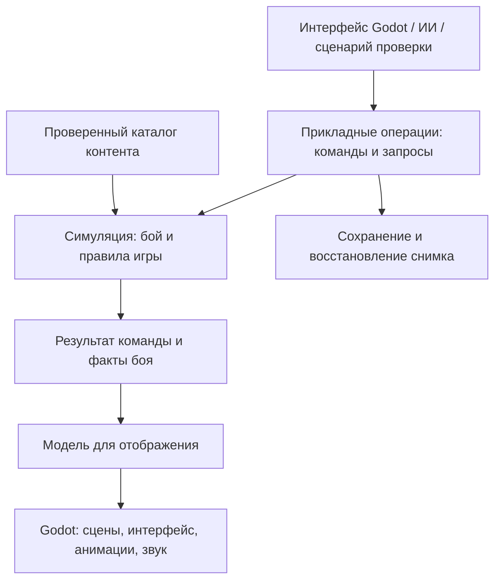

# Архитектура и план разработки тактической RPG на Godot

Обновление 10 сентября 2026: в **E:\GPT\SM2** реализованы M0–M4.4; последняя фактическая приёмка — [STATUS_M4_4.md](STATUS_M4_4.md). Пользователь уточнил целевую игру: Душа, воплощения в свежие трупы чистых людей, сохраняющийся мир и отдельный опыт характеристик/навыков.

**Приоритет документов:** [WORLD_CONCEPT.md](WORLD_CONCEPT.md) содержит подтверждённый концепт; [SOUL_BODY_PROGRESSION_ARCHITECTURE.md](SOUL_BODY_PROGRESSION_ARCHITECTURE.md) — новый проект постоянного состояния и развития; [DEVELOPMENT_ROADMAP.md](DEVELOPMENT_ROADMAP.md) — предложенный дальнейший порядок. Они заменяют прежний долгосрочный план компании наёмников. Этот документ сохраняет анализ тактической основы и общие инженерные принципы. Исторические примеры магии и кампании не утверждают отдельную фэнтезийную магию, линейную смену эпох или реализацию будущих модулей.

## 1. Рекомендуемое решение

Для одиночной игры на ПК с тактической основой Battle Brothers и развитием героя через практику, генетику, кибернетику и псионику выбран **типизированный GDScript**. Предлагаемая архитектура — **модульный монолит: симуляция независимо от игровых сцен, представление средствами Godot и расширяемые определения контента в данных**.

Модульный монолит означает одну игру и один процесс, внутри которых есть чёткие границы боя, персонажей, предметов, кампании и сохранений. Разные части проекта обращаются друг к другу через небольшие явные контракты. Правила боя запускаются автоматически в Godot без графического окна и загрузки игровых сцен. Для выполнения GDScript требуется среда Godot. Изменение спрайтов, интерфейса или скорости анимации не меняет результат сражения.

Главный критерий качества архитектуры — стоимость следующего изменения. Новый меч должен добавляться данными; новая раса — сочетанием определений и возможностей; принципиально новая механика — небольшим обработчиком правила, его данными, отображением и тестами. Обещать любые будущие механики без программирования было бы неправильно.

Исходные архитектура, боевое ядро, визуализация и расширения до областей уже реализованы. Предлагаемое продолжение: **малый цикл практики и покупки узла → развитие в бою → жизнь и новое воплощение в сохраняющемся мире → функциональное тело и улучшения → малая кампания → массовый контент**. Полная реализация всех будущих подсистем на следующем шаге не требуется; каждый срез должен завершаться работающим проверяемым примером. Детали и границы — в новом плане.

### Статус решений

| Статус | Содержание |
|---|---|
| Подтверждено | Godot; одиночная игра для ПК; близкая к Battle Brothers основа с последующими изменениями |
| Подтверждено | Архитектура прежде боевой реализации; затем небольшая визуализация и остальные механики |
| Подтверждено | Существенное развитие контента и необычных механик; сверхъестественные способности объясняются псионикой |
| Подтверждено | Душа, чистый человеческий носитель без унаследованных улучшений, управляемые спутники и сохраняющийся мир |
| Подтверждено | Собственный опыт каждого направления автоматически повышает уровень; покупка узлов расходует остаток без снижения уровня и продвижения |
| Подтверждено | Типизированный GDScript как основной язык игры |
| Подтверждено | Запуск игры двойным щелчком по файлу; предусмотреть его с первого технического этапа |
| Рекомендация | Ядро независимо от игровых сцен; модульный монолит; декларативный контент |
| Рабочее допущение | Первая сборка под Windows; мышь и клавиатура; гексы; 2D с условной высотой |
| Пока открыто | Подробности воплощения/анатомии, прогрессия Души, формулы развития, междисциплинарная оплата, псионический ресурс, призывы, размеры сражений и публичные моды |

За исключением явно отмеченных подтверждённых требований, технические решения ниже являются предложенным проектом архитектуры. Примеры способностей и численные значения в проверочных сценариях не утверждают игровой баланс и лор.

### Технологический выбор

Основной язык логики, интерфейса и внутренних инструментов — GDScript. Используется стандартная редакция Godot; дополнительные языки не входят в стартовый стек. На официальной странице загрузки при проверке 9 сентября 2026 года указана версия Godot 4.7.2. Версию движка и соответствующих экспортных шаблонов следует закрепить при создании проекта после проверки запуска и Windows-экспорта.[^1][^2]

| Область | Предлагаемая реализация на GDScript |
|---|---|
| Правила и изменяемое состояние | Типизированные классы на основе `RefCounted`, без загрузки игровых сцен |
| Авторские определения контента | Пользовательские `Resource` в `.tres`, проверяемые и преобразуемые в каталог |
| Представление | Сцены, узлы и сигналы Godot; обращения к приложению через команды и запросы |
| Сохранения | Явное преобразование состояния в версионированные данные и обратно |
| Проверки | Запускатель тестов в Godot без графического окна; отдельная ручная проверка UI |

Для параметров, возвращаемых значений, состояния и коллекций указываются типы, где язык это поддерживает. `Variant` и необработанные словари допускаются на границах загрузки с немедленной проверкой. Типизация помогает обнаруживать ошибки, но не обеспечивает сама по себе неизменяемость объектов или отсутствие циклических зависимостей.[^28]

Количество определений не предписывает выбор другого языка. Производительность оценивается на конкретных сценариях; оптимизация вводится по измеренной причине.

## 2. Общая архитектура



Стрелки на схеме показывают поток работы. Зависимости кода направлены внутрь: представление и файловые адаптеры знают прикладные контракты; правила не знают о сценах, файлах, звуке или кнопках.

### Слои и обязанности

| Часть | За что отвечает | Что в ней запрещено |
|---|---|---|
| Domain / Simulation | Состояния, ограничения, расчёт действий, последовательность эффектов | Зависимость от `Node`, `SceneTree`, исходных `.tres`, файлового ввода-вывода, анимаций и визуальных координат |
| Application | Начало боя, выполнение команды, завершение боя, сохранение, переходы между режимами | Вторые версии боевых формул и самостоятельные правила предметов |
| Content | Схемы определений, загрузка, разрешение ссылок, проверка совместимости | Изменяемое здоровье конкретного бойца или прочность конкретного меча |
| Infrastructure | Чтение файлов, сериализация, журнал диагностики, адаптеры ресурсов | Решение, кто получил урон, умер или заслужил награду |
| Presentation | Ввод, сцены, камера, интерфейс, изображения, звук, анимации | Самостоятельное списание AP, расчёт попаданий, выбор добычи |
| Tools / Tests | Проверки, массовые симуляции, просмотр контента и причин расчёта | Скрытое изменение релизных правил ради прохождения тестов |

У Godot есть собственные рекомендации по слабой связанности сцен и передаче зависимостей из родительского контекста. Предлагаемая архитектура развивает этот принцип для сложной тактической симуляции.[^3]

Для ядра допустимы `RefCounted` и встроенные типы значений Godot, например `Vector2i` для логической координаты. Его независимость относится к игровым сценам, вводу и отображению. Запускатель проверок может наследовать `SceneTree` как точка входа, но объекты боя не получают ссылку на него и не используют его жизненный цикл.[^29][^30]

### Модули предметной области

| Модуль | Владелец данных и правил | Когда реализуется |
|---|---|---|
| Battle | Карта боя, размещение, очередь, команды, эффекты, исход | Первым |
| Actors | Шаблоны существ, характеристики, способности, состояния | Минимум с первого этапа |
| Items | Определения и экземпляры предметов, экипировка, износ | Минимум в боевом этапе |
| Soul / Embodiment | Душа, её знания, привязка к телу и история воплощений | Минимальные связи в P1, переход жизни в P3 |
| Bodies / Progression | Тела, отдельный опыт и узлы, уровни и вычисляемые значения | P1–P2, анатомия позднее |
| Party | Главный герой и управляемые спутники, связи состава | Привязки в P2; найм/содержание отдельными решениями |
| World / Campaign | Сохраняющиеся тела и вещи, время, места, путешествие, встречи | Минимальный мир P3, малая кампания P6 |
| Contracts / Events | Задания, условия, выборы, последствия | Простые примеры в короткой кампании; развитие позже |
| Economy / Factions | Торговля, отношения, состояния поселений, кризисы | Последующие этапы |

Эта таблица задаёт будущие границы ответственности. На старте используется один проект Godot с отдельными каталогами ядра, прикладных операций, загрузчиков, представления и проверок; внутри ядра — предметные модули. Зависимости передаются явно. Границы поддерживаются соглашениями, проверкой ссылок скриптов и тестами, а не изоляцией отдельных сборок.

### Главные контракты

| Контракт | Смысл |
|---|---|
| `BattleState` | Единственное авторитетное состояние текущего сражения |
| `ContentCatalog` | Неизменяемые на время сессии проверенные определения |
| `BattleCommand` | Намерение действовать: кто, чем, по какой цели, в какой версии состояния |
| `BattleQueries` | Доступные действия, допустимые цели, путь, стоимость, предварительный расчёт |
| `CommandResult` | Принята ли команда, причина отказа, новая версия, упорядоченные факты |
| `BattleView` | Отделённые от изменяемой модели данные, которые разрешено видеть наблюдателю |
| `BattleSetup` | Вход в бой: участники, экипировка, условия, карта, правила и начальные значения генераторов |
| `BattleOutcome` | Результаты, которые возвращаются в кампанию |
| `SaveEnvelope` | Версии формата, правил и контента плюс снимок состояния |

Корневой узел `Main` собирает приложение и передаёт зависимости. Глобальные объекты допустимы для небольших технических функций, но боевое состояние не должно быть доступным для записи из любого узла. Общая шина сигналов тоже не должна становиться скрытым механизмом изменения мира.

Нужные точки замены, например источник случайности или хранилище сохранений, оформляются типизированными базовыми классами с явно описанными методами. Обработчики регистрируются при создании сессии. `class_name` называет тип, а не создаёт глобальный экземпляр службы. Между состояниями предпочтительны ссылки по стабильному ID: цикл сильных ссылок между объектами `RefCounted` не освобождается автоматически.[^31]

## 3. Что необходимо сохранить от Battle Brothers

### Игровое ядро

Battle Brothers соединяет свободную кампанию наёмного отряда и отдельные пошаговые сражения. Снаряжение определяет доступные приёмы, развитие не ограничено жёсткими классами, а потери бойцов и события создают долгосрочную историю компании.[^4]

**Аналитический вывод:** ценность игры возникает из связи решений на разных временных масштабах. На ходе выбирается позиция и риск атаки; после боя — лечение и замена снаряжения; в путешествии — следующий источник дохода; за кампанию — состав и специализация отряда. Простая гекс-сетка с вероятностью попадания воспроизведёт только небольшой фрагмент этого опыта.

### Тактические системы

| Система-ориентир | Зачем она нужна игроку | Вывод для собственной реализации |
|---|---|---|
| Гексы, препятствия, высота и видимость | Позиция меняет доступные действия | Координаты, занятость, видимость и достижимость — данные и запросы ядра |
| Индивидуальная инициатива | Важен порядок действий разных бойцов | Отдельный планировщик ходов; порядок не связан со списком узлов |
| Очки действий и усталость | Краткосрочный темп отличается от выносливости на длинной дистанции | Разные ресурсные правила; будущую ману не подменять усталостью |
| Попадание и защита | Игрок управляет вероятностью и последствиями риска | Расчёт должен объяснять вклад характеристик, позиции и эффектов |
| Броня и здоровье | Пробитие защиты и убийство — разные задачи | Разделить разрешение урона, расход защиты и изменение здоровья |
| Разные оружейные приёмы | Выбор оружия меняет тактику | Предмет предоставляет способности; кнопки не привязаны к классу оружия |
| Мораль и бегство | Можно разрушить строй и волю противника | Состояния морали, источники проверок и поведение отступления |
| Временные и постоянные травмы | Цена боя сохраняется после победы | Явно переносить постоянные последствия в кампанию |
| Разные враги и поведение ИИ | Одинаковый строй не решает любую встречу | Общие правила действий и разные профили принятия решений |

Позиционирование, индивидуальные ходы и видимость описаны в раннем дневнике тактических механик; очки действий, усталость, мораль и травмы присутствуют в текущем официальном описании игры. Ранний дневник используется для структуры системы, не как источник нынешних численных формул.[^5][^6]

**Аналитический вывод:** в собственной игре боевой баланс должен опираться на конфликт нескольких полезных качеств. Тяжёлая защита, скорость, дальность, контроль пространства и эффективность против конкретной цели должны иметь цену. Если магия позднее бесплатно решит все эти задачи, увеличение контента уменьшит тактическое разнообразие.

### Персонажи и развитие

Авторы отдельно подчёркивают роль предысторий и черт в привязанности к персонажам. В раннем описании перков сформулирован полезный принцип: развитие должно открывать способы игры, а не ограничиваться мелкими численными прибавками.[^7][^8]

Для собственной модели следует разделить:

- **Вид или расу:** базовые возможности, допустимое тело и особенности восприятия.
- **Предысторию:** происхождение, исходные склонности, социальные связи и условия событий.
- **Индивидуальность:** собственные значения характеристик, черты, имя, история.
- **Развитие:** накопленный опыт, приобретённые перки и способности.
- **Текущее состояние:** ранения, эффекты, экипировка, истощение.

Боец не должен принадлежать программному классу `HumanSwordsman`, который затем разрастается в `UndeadFireSummonedHumanSwordsman`. Композиция перечисленных частей позволяет получить такие сочетания без дерева наследования на каждую комбинацию.

### Кампания, деньги и последствия: исходный анализ

Ниже сохранён ранний проект цикла компании. После уточнения мира он служит материалом для отдельных занятий, а не обязательной основой всех жизней Души. Актуальные цели постоянного мира и кампании находятся в DEVELOPMENT_ROADMAP.md.

Разработчики рассматривали контракты как направляющую деятельность наёмников и отдельно объясняли проблемы однообразных, статичных поручений. Другой дневник связывает задания с положением вокруг поселений и последствиями действий; пример разветвлённого контракта показывает, что одна задача может иметь несколько исходов.[^9][^10][^11]

Первоначально для собственной кампании предлагался цикл:

**Выбор работы → подготовка → путешествие → бой → потери и добыча → восстановление → развитие → следующий выбор.**

Его поддерживают несколько связанных систем:

| Система | Роль в цикле | Минимальная собственная версия |
|---|---|---|
| Контракты | Дают цель и понятную ожидаемую награду | Одно поручение с победой, поражением и отказом |
| Путешествие и время | Создают стоимость перемещения и ожидания | Несколько точек и расход игровых дней |
| Содержание отряда | Делает простой экономическим решением | Жалованье и один вид припасов |
| Восстановление | Превращает повреждения в будущие издержки | Лечение и ремонт с затратой времени и ресурсов |
| Торговля | Превращает добычу в возможность подготовиться | Один магазин, покупка и продажа |
| Репутация и отношения | Делают выбор значимым за пределами боя | Один независимый показатель отношения к нанимателю |
| События | Связывают состав отряда с историями | Одно событие с условием по предыстории и двумя исходами |
| Кризисы | Меняют условия уже знакомого мира | После устойчивого основного цикла |

Это проект первого собственного цикла, не перечень всех правил оригинала. Особенно важно не путать экономику со складом золота: время, лечение и содержание должны конкурировать за тот же бюджет, из которого покупается развитие.

### Границы сходства

Рабочая цель — собственная реализация близких механик, с собственными данными и последующей визуальной системой. Для первого боя берётся узнаваемая логика позиционирования, усталости, оружейных ролей и потерь. Полный каталог оригинальных предметов, событий и противников не нужен для проверки основы.

Точные пределы вероятности попадания, порядок округления, формулы пробития брони, восстановления усталости, ожидания и начисления инициативы в этой работе **не установлены как спецификация текущей версии Battle Brothers**. Перед реализацией соответствующего правила потребуется либо отдельная проверка выбранной версии игры, либо явное принятие собственной формулы с пометкой о различии.

Показательный пример риска источников: переработка Alp в 2019 году изменила его механику. Дневник более ранней версии может достоверно описывать историю разработки и одновременно не описывать актуальный бой.[^12]

### Что показывают дополнения

| Дополнение | Подтверждённое направление расширения | Архитектурный вывод |
|---|---|---|
| Lindwurm | Новый противник, добыча и тематические предметы[^13] | Даже маленькое дополнение пересекает границы боя и предметов |
| Beasts & Exploration | Существа, места, изготовление предметов, улучшения брони, задания и события[^14] | Трофей, рецепт, экипировка и встреча должны ссылаться на согласованные определения |
| Warriors of the North | Происхождения компании с особыми правилами, фракция, чемпионы и экипировка[^15] | Начало кампании может менять постоянные правила, а не только стартовый инвентарь |
| Blazing Deserts | Южные регионы и города, арена, небоевые спутники, новые предметы и кризис[^16] | Один боевой модуль должен обслуживать разные причины и условия столкновения |
| Of Flesh and Faith | Происхождения с клятвами и исследованием существ, связанные события и снаряжение[^17] | Особая кампания может переопределять развитие и доступный контент |

**Аналитический вывод:** большая библиотека контента состоит из связанных наборов: существо → способности → поведение → добыча → применение добычи → места встреч → контракт → события → изображения и тексты. Проверка такой цепочки важнее количества строк в таблице оружия.

### Необычные механики как проверка основы

Официальные описания Hexe, Schrat, Ifrit и Ancient Priest дают особенно полезные примеры: изменение контроля и связанный урон; появление существа после повреждения; соединение и распад существ; длительное воздействие на клетки. Это подтверждённые описания дизайна соответствующих версий, не восстановленная актуальная спецификация всех исключений.[^18][^19][^20][^21]

Для собственной игры это означает, что система должна выдерживать изменение состава сражения, работу эффектов вне персонажа, перенос контроля и причинные цепочки повреждений. Ограничение «каждый участник — человек с обычной атакой» пришлось бы снимать очень рано даже при близком следовании оригиналу.

## 4. Модель данных и производство контента

### Три вида данных

| Вид | Пример | Правило |
|---|---|---|
| Определение | Тип железного меча: свойства, способности, визуальный ключ | Одно на весь каталог; неизменяемо во время игры |
| Экземпляр | Конкретный меч: ID, владелец, износ, улучшения | Собственное изменяемое состояние |
| Модель чтения | Название меча и пояснение урона в открытой карточке | Не даёт права изменять экземпляр |

Godot повторно использует загруженные ресурсы. Поэтому запись текущего здоровья или износа в общий `Resource` может непреднамеренно связать несколько экземпляров. Пользовательские ресурсы подходят для авторских определений и редактирования в Inspector; живое состояние бойцов, предметов и эффектов хранится в отдельных типизированных объектах `RefCounted`.[^22]

### Какие определения нужны

| Семейство | Содержание |
|---|---|
| `SpeciesDefinition` | Вид, возможности, тело, исходные особенности |
| `BodyPlanDefinition` | Участки защиты, слоты, совместимость экипировки |
| `ActorTemplate` | Конкретный тип противника или основа найма |
| `StatDefinition` | Идентификатор характеристики, смысл, границы, формат показа |
| `ItemDefinition` | Свойства, экипировка, выдаваемые способности |
| `AbilityDefinition` | Условия, цель, стоимость, операция и её параметры |
| `StatusDefinition` | Модификаторы, триггеры, длительность, накопление и снятие |
| `TerrainDefinition` | Проходимость, стоимость, высота, взаимодействия |
| `AiProfileDefinition` | Цели, веса оценок, предпочтения и допустимые стратегии |
| `EncounterDefinition` | Состав встречи, условия появления и цели боя |
| Последующие семейства | Перки, добыча, рецепты, контракты, события, поселения, происхождения компании |

В первом этапе реализуются только определения, участвующие в проверочном сценарии. Поля будущих семейств не следует выдумывать заранее. Расширяемость обеспечивается общими правилами идентификации и загрузки плюс предметными схемами.

### Формат и идентификаторы

Для авторского контента на старте рекомендуются пользовательские ресурсы GDScript в текстовых файлах `.tres`: например, `ItemDefinitionResource` с типизированными экспортируемыми полями. Их можно редактировать в Inspector. Загрузчик проверяет тип ресурса, схему и предметные ограничения, после чего создаёт отделённые определения `ItemDefinition` в каталоге. Бой получает проверенные значения, а не исходные редакторские ресурсы.[^22]

Неизменяемость каталога — контракт приложения. Исходные ресурсы и вложенные изменяемые коллекции не выдаются внешним потребителям для записи; модели чтения отделяются копированием значений. Собственные операции снимка и копирования проверяются на вложенных объектах. Одной поверхностной копии, `const` или признака только чтения на внешней коллекции недостаточно для изоляции всего графа состояния.

Пример стабильного ID контента: `core:weapon.iron_sword`. Он отличается от ID конкретного предмета и от пути `res://...`. Название для игрока хранится под ключом локализации; смена имени или перенос картинки не меняет идентичность предмета.

Один параметр имеет один авторский источник. Если позднее понадобится импорт больших таблиц или пакетов JSON, отдельный импортёр должен выдавать тот же проверенный каталог; генерируемые файлы не редактируются параллельно с исходными. JSON остаётся предложенным форматом снимков сохранения. Поддержка стороннего исполняемого контента через загрузку `.tres` не подразумевается: встроенные авторские ресурсы используют известные скрипты проекта.

Минимальный пакет содержит ID, версию, версию схемы, зависимости, список определений и явные замены. Загрузка проходит этапы:

1. Прочитать все выбранные пакеты в отдельный кандидатный каталог.
2. Проверить схемы, уникальность ID, типы ссылок, зависимости и конфликты.
3. Разрешить ссылки, собрать индексы и проверить предметные ограничения.
4. Вычислить идентификатор состава каталога и опубликовать его целиком.

Ошибка загрузки ресурса, неизвестный тип определения, несуществующий навык, отрицательная длительность или конфликт замены должны давать ошибку с указанием пакета, записи и проблемного свойства. Неудачная загрузка не оставляет половину нового контента в действующей игре.

### Что означает добавление контента

| Изменение | Работа с данными | Работа с кодом |
|---|---|---|
| Ещё один меч с существующими приёмами | Определение, локализация, изображение, включение в добычу | Обычно не нужна |
| Новый враг с готовыми способностями | Шаблон, профиль ИИ, снаряжение, встреча | Обычно не нужна |
| Яд с другими параметрами уже существующего периодического эффекта | Определение эффекта и источника | Обычно не нужна |
| Первая телепортация | Определение, цена, цель, визуализация | Новый обработчик перемещения и проверки |
| Первое отражение заклинаний | Условия и параметры | Правило реакции, защиты от циклов и тесты взаимодействий |
| Новый вид существа с принципиально иным телом | Новый профиль | Возможна доработка правил экипировки, попаданий и визуализации |

Данные описывают разрешённые операции, а не исполняют произвольный код. Отдельный язык сценариев способностей, редактор графов и внешние кодовые моды нужны только при подтверждённой потребности. Godot поддерживает пакеты PCK/ZIP, но разрешение конфликтов и совместимость правил всё равно должны задаваться самой игрой.[^23]

## 5. Боевой движок

### Состояние и геометрия

`BattleState` включает карту, участников, экземпляры предметов, активные эффекты, отношения сторон, очередь активаций, цели, состояние случайности и номер ревизии. Один прикладной исполнитель владеет записью. Другие части получают запросы или отделённые модели чтения.

Координата клетки — целочисленная пара `q, r` в осевой системе гексов. Высота, поверхность, препятствия, занятость и поля эффектов — отдельные свойства. Экранное положение рассчитывает представление. Направление камеры и масштаб картинки не участвуют в поиске пути или попаданиях.

Участник занимает одну клетку в первом боевом срезе. Проверки размещения и перемещения проходят через один сервис. Многоклеточные существа, полёт и разные уровни пространства потребуют отдельных правил; общий сервис локализует эти изменения, но не делает их бесплатными.

Поиск пути использует реальные правила движения: стоимость клетки, перепад высоты, занятость и допустимые переходы. Для начального графа достаточно обычных A* и Dijkstra. Для карты достижимости важен бюджет движения; для будущего ИИ — стоимость и опасность маршрута. Произвольная линия между спрайтами не заменяет этот расчёт.

### Ходы и ресурсы

Планировщик хранит ID участников и отдельные записи их активаций. Нужно различать ход бойца, конец раунда, ожидание, завершение действий, пропуск из-за состояния, выход из боя и появление нового участника. Равная инициатива разрешается стабильным правилом, а не порядком перебора коллекции.

AP — расходуемый бюджет действий. Усталость — накапливаемая нагрузка с отдельным пределом и восстановлением. Для будущей маны полезна расширяемая коллекция ресурсов, однако каждый ресурс сохраняет свой смысл. Списание AP, увеличение усталости и расход маны проверяются вместе: нехватка последнего не должна оставлять уже потраченные первые два.

Условия восстановления, стоимость ожидания, ограничения тяжёлой брони и вход призыва в очередь фиксируются в версии правил до реализации соответствующей механики. Не следует разбрасывать эти решения по обработчикам кнопок.

### Единый путь выполнения действия

1. Игрок, ИИ или проверочный сценарий создаёт команду с ID бойца, способности, цели и ожидаемой ревизией.
2. Симуляция проверяет актуальность, право действовать, доступность способности, видимость, цель и стоимость.
3. Подготавливается действие и предусмотренные окна реакций: например, запрет действия или изменение цели. После реакции повторно проверяются затронутые условия — существование и допустимость цели, доступность действия и возможность оплаты.
4. Фиксируется попытка и её затраты по правилам способности.
5. Выполняются необходимые проверки и операции: попадание, величина воздействия, защита, перемещение, состояния.
6. Обрабатываются последствия в установленном порядке: травма, смерть, мораль, ответное действие, создание существа.
7. Проверяется целостность результата, публикуется новая ревизия и упорядоченный список фактов.
8. Представление проигрывает эти факты и обновляет доступные действия.

Попадание нужно оружейной атаке, но не обязательно лечению или перемещению. Поэтому общая процедура координирует набор типизированных операций, а не заставляет каждую способность проходить бессмысленную оружейную формулу.

Команда, отклонённая исходной проверкой, не меняет состояние, ревизию, источник ID и генератор случайности. Прерывание уже принятого действия реакцией — другой, штатный исход: публикуются действительно произошедшие реакции и предусмотренные правилами затраты. Например, отменённое заклинание не обязательно бесплатно; это определяется правилом прерывания, а не технической ошибкой.

Для первого небольшого боя удобно разрешать всю команду на отделённом кандидатном состоянии. Оно создаётся явным копированием типизированного состояния или восстановлением из снимка: вложенные бойцы, эффекты, очереди и источники ID/случайности также должны быть отдельными. После проверки кандидат заменяет активное состояние. Если впоследствии копирование станет дорогим, внутреннюю реализацию можно заменить журналом изменений, сохранив контракт атомарного выполнения команды.

Реакции на промежуточные шаги движения обязательны: боец может войти в опасную клетку или погибнуть до конца маршрута. Такое штатное прерывание — принятый частичный путь с реальными затратами за выполненные шаги; это отличается от технической ошибки, при которой кандидат не публикуется.

### Расчёт характеристик и урона

Базовое значение, постоянные изменения, экипировка, состояния и контекст действия не смешиваются в одно постоянно переписываемое число. Запрос формирует итоговый профиль действия с объяснением причин.

Предлагаемое соглашение для обычных модификаторов: база → плоские прибавки → суммарные процентные поправки → явно разрешённые отдельные множители → границы → округление. Особые замены значения имеют отдельный приоритет и явное правило конфликта. Это собственный технический контракт, а не формула Battle Brothers; он должен быть зафиксирован и протестирован на конкретных примерах.

Для первого среза достаточно здоровья и отдельных участков защиты головы/тела. Объект воздействия должен содержать источник, цель, тип урона, участок и применимые свойства пробития. Нужна возможность добавить новый способ защиты или сопротивления в обработчик расчёта; симулятор крови и внутренних органов сейчас не требуется.

В интерфейс возвращается объяснение: базовый шанс, модификаторы, итог; диапазон повреждения; причины невозможности действия. Будущий урон огнём, холодом или заклинанием использует этот же механизм объяснения и собственные параметры.

### Эффекты, реакции и их порядок

Каждый экземпляр эффекта хранит ID определения, источник, цель или область, момент наложения, оставшуюся длительность, число накоплений и собственные необходимые параметры.

До ввода эффекта задаются правила:

- на каком событии он срабатывает и когда уменьшается длительность;
- суммируется ли с таким же эффектом, обновляет ли срок или заменяет прежний;
- может ли действовать несколько источников одновременно;
- какие иммунитеты, рассеивание, смерть и выход из боя его снимают;
- что происходит при исчезновении источника;
- сохраняется ли он между боями.

«На два хода» недостаточно: нужны два хода носителя, два хода создателя или два раунда. Различие становится критичным при призывах, пропуске хода и изменении инициативы.

До нанесения урона работает окно предотвращения и модификации. После публикации `DamageApplied` факт уже состоялся: последующее лечение является новым результатом, а не отменой старого события. Отражение, вампиризм и цепочки смерти разрешаются внутренней очередью правил.

У очереди фиксируются фаза, приоритет, порядок наложения и стабильный ID для разрешения равенства. Для причинных цепочек нужны исходная команда и источник реакции, правило повторного срабатывания и диагностический предел работы. Бесконечная петля отражений должна воспроизводимо выявляться как ошибка, а не молча обрезаться или зависать.

### ИИ и предварительный расчёт

ИИ получает те же допустимые действия, цели, затраты и расчёты, что интерфейс. Первый ИИ можно строить как оценку вариантов: ожидаемая польза, риск ответного удара, положение, расход ресурсов и цель встречи. Несколько профилей дают стрелка, агрессора и защитника без отдельных версий боевых правил.

Перечень всех вариантов нужно ограничивать осмысленно: достижимые позиции, потенциальные цели, небольшой набор интересных комбинаций «движение + действие». Иначе добавление сотни способностей создаст перебор слишком большого пространства.

Запрос предварительного расчёта не расходует боевой генератор случайности. Он показывает шанс и диапазон, а не будущий фактический бросок. Сложные каскады могут описываться как условные последствия. Точное перечисление всех возможных будущих состояний не требуется.

Информация ограничивается наблюдателем. Ни подсказка, ни ИИ не должны автоматически получать невидимых врагов из полного состояния. Окончательный исполнитель всё равно проверяет команду заново, поскольку ревизия могла измениться.

## 6. Основа для магии, рас и призывов

### Способность как сочетание общих частей

Полезная схема: **источник → условия → цель/область → цена → операции → реакции → отображение**.

| Пример будущего контента | Из чего он собирается | Что проверяет в архитектуре |
|---|---|---|
| Удар мечом | Оружие, соседняя цель, AP/усталость, попадание, физический урон | Базовый путь действий |
| Огненный снаряд | Умение, видимая цель, AP/мана, воздействие, горение | Другой ресурс и тип воздействия |
| Ядовитое облако | Выбранные клетки, поле с длительностью, фильтр восприимчивости | Эффект существует вне конкретного бойца |
| Призыв существа | Допустимое размещение, цена, создание актёра и записи очереди | Состав боя изменяется после начала |
| Очарование | Проверка восприимчивости, временный контроль, срок и возврат | Сторона и постоянная принадлежность различаются |
| Воскрешение | Останки как цель, правило возвращения, ограничения наград | Смерть не равна удалению всей истории |

Это примеры для проектирования и испытаний. Набор школ, формулы заклинаний и наличие конкретных способностей ещё не определены.

### Принадлежность и управление

Нужны четыре разные сущности отношения:

| Поле | На какой вопрос отвечает |
|---|---|
| Постоянный владелец | Кому персонаж или существо принадлежит в кампании? |
| Текущая сторона | Кого он считает союзником, врагом или нейтральным? |
| Контролирующий агент | Кто сейчас выбирает действие: игрок, ИИ или эффект? |
| Создатель и источник | Кто и какой способностью его призвал или преобразовал? |

У обычного наёмника ответы часто совпадают, у очарованного призыва — могут различаться. Проверка враждебности проходит через отношение сторон: несовпадающие ID не обязательно означают вражду.

### Призыв и жизненный цикл

Правило создания проверяет место, лимиты и стоимость до публикации результата. Новый участник получает собственный ID, состояния, управление, срок жизни и явную политику первой активации. Очередь не должна заранее предполагать неизменный список бойцов.

При добавлении самой механики предстоит решить: призыв ходит сразу, после создателя или в следующем раунде; исчезает ли после боя; даёт ли опыт врагу; оставляет ли добычу и тело; сохраняется ли после гибели создателя. На архитектурном этапе достаточно одного технического варианта и проверенного места для такого правила.

Разделяются смерть, создание останков, уничтожение останков, исчезновение временного существа и преобразование в другую форму. Победа проверяется с учётом правила участия: временный объект, бесконечно создающий новых существ, не должен случайно блокировать окончание боя. Возвращение из мёртвых требует выбора политики ID и очереди, чтобы исключить дубли и повторные ходы.

### Как удержать тактическую ценность будущей магии

Это рекомендации к последующему дизайну, не принятые правила: ограничивать универсальность заклинаний ценой подготовки, ресурсами, позицией, дальностью, риском и доступными противодействиями. Лечение и воскрешение особенно сильно влияют на экономику потерь. Бесконечное лечение вне боя способно убрать смысл травм и восстановления; бесплатные призывы — смысл найма и содержания. Эти связи нужно проверять в кампании, даже если сами способности технически добавляются легко.

## 7. Воспроизводимость и сохранения

### Что именно должно воспроизводиться

Одинаковые исходное состояние, версии правил и контента, состояния генераторов и последовательность команд должны давать одинаковый результат. Это позволяет исправлять редкие ошибки, сравнивать баланс и продолжать сохранённый бой.

Для этого используются стабильные порядки перебора, правила равенства инициативы, целочисленная геометрия и явно заданное округление. В боевые решения не попадают реальное время, число кадров, порядок узлов, длительность звука и завершение анимации.

ID новых участников, предметов и эффектов выдаёт детерминированный источник, например сохраняемый монотонный счётчик в области сессии. Его состояние входит в снимок вместе с пространством имён сессии. Случайные GUID при каждом повторе и восстановление счётчика только по живым участникам не подходят: исчезнувший призыв не должен освобождать свой ID для нового существа. Предварительные запросы не расходуют этот счётчик, а технический откат кандидата откатывает и его.

Случайность боя, мира, решений ИИ и визуальных эффектов следует разделить на независимые потоки с сохраняемым состоянием. Для долгосрочной поддержки нужен собственный типизированный контракт `RandomSource`, фиксированный алгоритм с версией и проверочные последовательности. В документации Godot внутренний алгоритм генератора прямо назван деталью реализации, на которую нельзя опираться как на вечный формат.[^24]

Повтор старой партии после изменения формул — отдельная задача совместимости. Сам по себе seed не сохраняет прежние правила. Воспроизводимость гарантируется для зафиксированной конфигурации; миграция сохранения может позволить продолжить игру по новым правилам, не сохранив старый повтор.

### Содержание сохранения

В снимок входят:

- версия формата, версии правил и пакетов с идентификатором их состава;
- режим сессии, ревизии, стабильные ID и состояние источника новых ID;
- постоянные персонажи, предметы, состояния компании и мира по мере появления модулей;
- при активном бое — карта, участники, размещение, очередь, эффекты, цели и случайность;
- состояние перехода между боем и кампанией, уже применённые результаты.

Не сохраняются ссылки на узлы, открытые кнопки, `Callable`, сигнальные соединения, текстуры и вычислимые кэши. Файловые структуры описываются явно и преобразуются в типизированные объекты GDScript после проверки. Сериализация не является автоматической выгрузкой любого внутреннего объекта. JSON удобен для читаемого первого формата, но размер и собственные типы требуют внимания; это отмечает и документация Godot.[^25]

Числа JSON при разборе Godot проходят через `float`. Поэтому 64-битные идентификаторы, счётчики и состояние генератора записываются точными строковыми представлениями и восстанавливаются с проверкой диапазона. Обычные числовые поля проверяются на целочисленность и допустимый диапазон до преобразования. Это исключает незаметную потерю точности, которая могла бы нарушить продолжение боя.[^32]

Сохранение разрешено в устойчивой границе между полностью разрешёнными командами. Если на экране ещё идёт анимация, логическое состояние уже определено; после загрузки можно показать его сразу. Сохранение в середине незавершённой цепочки реакций на старте не поддерживается. Если впоследствии появятся реакции с отдельным выбором игрока, состояние ожидаемого выбора станет явной сохраняемой фазой.

### Запись и загрузка

Запись: создать временный файл в каталоге сохранений → закончить запись → прочитать обратно и проверить → опубликовать новую версию с резервной копией. Устойчивость к прерыванию операции проверяется испытаниями отказов на целевой платформе; одного названия «атомарное сохранение» недостаточно.

Загрузка: прочитать файл → определить формат → провести известные миграции → проверить контент и ссылки → собрать отдельную сессию → проверить её целостность → заменить текущую сессию. Повреждённый файл не уничтожает уже открытый бой. Неизвестный обязательный пакет даёт понятную ошибку; скрытая замена предметов по умолчанию не выполняется.

Миграции формата данных и изменения баланса — разные процессы. Для старой версии формата допустима пошаговая миграция; для несовместимого состава контента нужен установленный порядок обновления или объяснённый отказ. Первую искусственную миграцию следует проверить рано, чтобы сам механизм не оказался фикцией.

Основное сохранение — снимок. Журнал команд и событий нужен для диагностики и повторов. Восстановление всей игры только через проигрывание многолетней истории событий не требуется.

## 8. Небольшая визуализация

Первое игровое окно должно помогать оценивать решения. Художественная детализация появится после проверки читаемости и темпа.

Минимальный экран содержит гекс-поле, условные фигурки, активного бойца, доступные клетки, путь и стоимость, цели способности, здоровье и защиту, AP и усталость, очередь и журнал. Подсказка объясняет запрет действия и известные модификаторы. Раса, дополнительный ресурс или новая способность приходят в интерфейс через описание и модель чтения.

Карта рисуется средствами Godot 2D; выбор между `TileMapLayer` и собственным рисованием клетки решается маленьким визуальным экспериментом. Фигурки могут быть сценами `Node2D`; это не обязывает хранить их состояние в узлах. Логические высоты переводятся в смещение и порядок отображения, сохраняя отдельную боевую геометрию.

Предлагаемая структура представления:

```text
Main
├─ SessionHost
└─ BattleScreen
   ├─ MapView
   ├─ ActorViews
   ├─ EffectsView
   ├─ Camera
   └─ HUD
      ├─ TurnOrder
      ├─ ActorPanel
      ├─ AbilityPanel
      └─ CombatLog
```

Экран отправляет команду и показывает результат. В доменной симуляции нет ожидания `animation_finished`. Пропуск или ускорение анимаций приводит к тому же состоянию. На время отображения экран может блокировать следующий ввод; это ограничение интерфейса, а не скрытая часть боевой математики.

Ручная проверка обязательна: можно ли распознать выбранную клетку, понять цену атаки, различить союзника и врага, увидеть причину потери здоровья, ускорить ход ИИ. Запуск без окна не доказывает качество интерфейса.

## 9. Как подключать остальные механики

### Переход между кампанией и боем

Кампания формирует `BattleSetup` с постоянными ID участников, состояниями предметов, условиями встречи и правилами. На время боя она хранит активный `encounter_id` и не применяет параллельное лечение, торговлю или переэкипировку к переданным участникам.

Бой возвращает `BattleOutcome`: кто выжил, какие изменения получили персонажи и вещи, какие цели выполнены и какие боевые факты произошли. Распределение опыта, добычи и договорной оплаты выполняют владельцы соответствующих правил при обработке результата. Итог не должен зависеть от того, открыт ли экран награды.

Применение результата проверяет ID встречи и ревизию кампании. Изменения кампании и отметка «результат применён» публикуются в одном снимке. Повтор после сбоя или загрузки не создаёт вторую награду. Временные призывы не попадают в постоянный ростер простым копированием списка участников.

Этот контракт можно проверить на маленькой тестовой кампании задолго до карты мира. Для архитектуры достаточно передачи участников и однократного возврата результата; полноценная экономика появляется позже.

### Ростер, предметы и развитие

После боевого прототипа подключаются постоянные персонажи, смена экипировки, износ, опыт, небольшой набор перков и найм. Служба экипировки проверяет слоты и совместимость тела; виджет инвентаря только запрашивает перенос.

Уникальные предметы хранят фактические выпавшие значения улучшений в экземпляре. Перки и расовые свойства предоставляют модификаторы, способности или ограниченные реакции через общую систему. Постоянная травма имеет другую длительность и перенос между режимами, но не отдельную скрытую версию расчёта характеристик.

### Время и мир

Кампания получает собственные игровые часы. Путешествие, восстановление и содержание используют эти часы. Скорость изображения мира может меняться независимо. Первый мир — несколько точек, маршруты и встречи; процедурная генерация большого пространства подключается после работающего цикла.

Мировые процессы не должны все выполняться каждый кадр. По мере роста применяются запланированные события, ограниченная частота обновления и более подробный расчёт в активном регионе. Это собственная стратегия реализации, а не утверждение о внутреннем устройстве Battle Brothers.

### Контракты, события и экономика

Контракт хранит текущую стадию, привязанных участников и места, дедлайн, условия перехода и награды. Текст описывает состояние, но не является кодом, меняющим золото и здоровье. Система событий выбирает подходящих участников, показывает доступные варианты и передаёт последствия в прикладные операции.

Боевые эффекты и события кампании могут использовать схожую форму «условие → действие», но должны иметь разные типизированные операции и контексты. Не стоит объединять цену товара, страх бойца и строительство здания в один универсальный исполнитель только из-за похожих слов.

Экономика растёт от понятного магазина и содержания отряда к предложениям поселений, местным обстоятельствам и связям фракций. В дневнике о связанных локациях Battle Brothers авторы описывали замену абстрактного богатства поселения более видимыми причинами различий. Для собственной игры полезен этот принцип объяснимости, без предположения о точной модели современной экономики оригинала.[^26]

## 10. Масштабирование

### Три независимых масштаба

| Нагрузка | Возможная проблема | Первый подход |
|---|---|---|
| Тысячи определений | Загрузка, ссылки, поиск, объём изображений | Индексы метаданных, проверка пакетов, загрузка тяжёлых материалов по потребности |
| Много участников и эффектов в одном бою | Поиск пути, перебор ИИ, массовые реакции | Индекс занятости, локальные запросы, ограничение кандидатов ИИ, стабильные очереди |
| Большой живущий мир | Число активных процессов и объём состояния | Игровое расписание, частоты обновления, региональная детализация |

Наличие десяти тысяч мечей в каталоге не требует десяти тысяч сцен на карте. И наоборот, небольшой каталог не гарантирует быстрый бой со сложными массовыми эффектами.

Для планирования предлагаются контрольные сценарии: сначала бой 3 на 3, затем обычный бой на несколько десятков участников и отдельная нагрузочная проверка на 100 участников; каталог на 1 000 и 10 000 искусственных определений. Это тестовые масштабы, не утверждённый предел и не обещание производительности.

Измеряются время загрузки каталога, память, время полного решения ИИ, поиск пути, разрешение массового эффекта и размер/скорость сохранения. Для каждого измерения фиксируются машина, сборка, правила, seed и сценарий. Конкретный допустимый бюджет задержки устанавливается после первого измерения и выбора желаемого темпа игры.

### Что оптимизировать по мере необходимости

В первую очередь — число запросов и кандидатов, повторные вычисления, копирование состояния, поиск по всем эффектам и загрузку лишних материалов. Кэш должен учитывать ревизию и контекст цели: итоговый шанс нельзя сохранять только по ID атакующего.

При доказанном узком месте можно добавить пространственные индексы, поля расстояний, пакетное рисование, более компактное хранение компонентов или вычисления на отделённом снимке. Активное дерево сцен Godot не является безопасной общей памятью для произвольных потоков; официальная документация отдельно предупреждает об этом.[^27]

Большая часть одиночного пошагового боя сначала выполняется последовательно. При фоновом расчёте ИИ результат несёт ревизию снимка и повторно проверяется перед применением. Новый поток не получает права менять тот же бой одновременно с главным исполнителем.

### Чего не требуется на старте

| Решение | Почему пока избыточно | Когда вернуться |
|---|---|---|
| Микросервисы и серверная инфраструктура | Игра локальная и одиночная | При отдельном реальном сетевом продукте |
| Универсальный ECS для всей игры | Добавляет сложность хранения и диагностики до измерений | При доказанной нагрузке на большое число однотипных сущностей |
| Собственный язык программирования заклинаний | Требует редактора, ошибок, отладки и совместимости языка | Когда набора типизированных операций действительно недостаточно |
| Полный визуальный редактор контента | Ранние схемы ещё меняются | После серии реально созданных существ и способностей |
| Перезагрузка правил посреди боя | Усложняет кэши, состояния и повторы | При отдельной доказанной ценности |
| Сетевая синхронизация | Не входит в выбранный режим игры | При изменении требований; потребует отдельной работы |
| Полная совместимость всех будущих сохранений | Невозможно честно гарантировать заранее | Версионирование сразу, конкретные миграции при изменениях |

Масштабируемая архитектура не обязана содержать каждый механизм заранее. Она должна показывать, в какой модуль добавляется новое правило, кто владеет изменяемыми данными и какими проверками подтверждается совместимость.

## 11. Этапы и критерии готовности

Актуальная последовательность — [DEVELOPMENT_ROADMAP.md](DEVELOPMENT_ROADMAP.md). Обновление архитектуры согласовано как работа с документами; следующая реализация не начата. Календарные сроки и гарантии производительности до измерений не назначаются.

| Этап | Что создаётся | Результат, после которого идём дальше |
|---|---|---|
| M0–M4.4 | Уже реализованы: запуск, ядро, поле в окне, эффекты, мана, способности ИИ, область | Состав и приёмка — соответствующие IMPLEMENTATION/STATUS; расы и призывы не объявляются готовыми |
| P1. Практика и узлы | Маленькая лаборатория с Душой/телом, отдельными запасами опыта, автоматическими уровнями и покупкой | Действие, рост, покупка без потери уровня, UI и сохранение |
| P2. Развитие в бою | Индивидуальные данные участников и общая транзакция боя/опыта | Прогноз, ИИ, выполнение и снимок используют одни значения |
| P3. Цикл жизней | Минимальный постоянный мир, тайник, смерть и новое воплощение | Знания/мир сохраняются, практика нового воплощения стартовая |
| P4. Функциональное тело | Анатомия нужного среза, протез, безоружный вариант, затем расширение слотов | Функции тела и экипировка определяют допустимые действия |
| P5. Пути улучшений | По одному примеру псионики, генетики и кибернетики; призыв после определения природы | Комбинация работает с UI, ИИ и сохранением |
| P6. Малая кампания | Несколько мест с разными технологическими возможностями | Несколько деятельностей и жизней изменяют общий мир |
| P7. Контент и инструменты | Массовое авторство, зависимости, нагрузочные измерения | Проверенный процесс добавления тысяч узлов и другого контента |

Далее сохранена историческая детализация первоначальных M0–M8. Она объясняет исходные критерии проектирования и не является действующим списком следующих заданий. Реально выполненный объём определяется IMPLEMENTATION/STATUS, будущий — новым планом P1–P7.

### Детализация M0: запуск двойным щелчком

В корне проекта создаётся **«Запустить игру.cmd»**. Во время разработки это постоянная точка запуска текущей версии проекта: двойной щелчок открывает игру без необходимости вручную открывать редактор или вводить команды. В M0 показывается стартовое окно; затем тот же файл запускает развивающийся прототип.

Файл определяет папку проекта относительно собственного расположения и использует закреплённую версию Godot из локальной настройки. Он запускает проект в игровом режиме. Подготовка первого запуска и импорт ресурсов при необходимости выполняются автоматически с проверкой результата. Если движок не найден или проект не загрузился, остаётся понятное сообщение с причиной и местом журнала ошибки. Неудачная подготовка не продолжается как успешный запуск игры.

Приёмка проверяет реальное открытие игрового окна и загрузку стартовой сцены, повторный запуск, запуск из другой текущей папки, пути с пробелами и кириллицей, а также понятный отказ при недоступном движке. Одного успешного кода завершения файла запуска недостаточно. Запуск и подготовка не удаляют пользовательские сохранения; проверки используют отдельные тестовые данные.

Готовая распространяемая сборка получает обычный исполняемый файл `.exe` и необходимые файлы игры. Для неё проверяется запуск без установленного редактора Godot. Имя экспортированной игры определяется после выбора названия проекта; файл запуска прототипа создаётся уже в M0.

### Детализация M1: архитектура, которую можно проверить

M1 не ограничивается пустой структурой каталогов. Он содержит техническую миниатюру с двумя бойцами, небольшим полем и условным действием. Числа условного урона нужны для испытания контрактов; реальная боёвка развивается в M2.

Последовательные части M1:

1. Создать один проект Godot с каталогами ядра, прикладных операций, представления и проверок; добавить проверку запрещённых зависимостей.
2. Сделать типы ID, определения, экземпляры и строгую загрузку малого каталога.
3. Реализовать `BattleState`, команды движения, условного действия и завершения хода.
4. Подключить общие запросы, объяснение отказа, ревизию и фиксированную случайность.
5. Ввести один обычный эффект, упорядоченный результат и диагностическую трассу.
6. Проверить техническое создание третьего участника через зарегистрированную операцию.
7. Сохранять и восстанавливать снимок; проверить миграцию и обработку повреждения.
8. Проверить однократный возврат результата в минимальную заготовку кампании.

Критерии приёмки M1:

| Проверка | Ожидаемое поведение |
|---|---|
| Ядро независимо от игровых сцен | Выполняет сценарий в Godot без графического окна, игровых сцен, Autoload с состоянием и узлов представления |
| Два независимых боя | Не разделяют изменяемые объекты, случайность или очереди |
| Кандидатное состояние и модель чтения | Изменение вложенного объекта кандидата или выданной модели не меняет активное состояние |
| Повторное открытие и закрытие боя | После освобождения сессии не накапливаются объекты из-за циклов ссылок или удерживаемых обработчиков |
| Два предмета одного типа | Износ одного не меняет второй и общее определение |
| Неверная или устаревшая команда | Состояние, ревизия, источник ID и случайность остаются прежними |
| Запросы между командами | Любое число подсказок не меняет будущие броски |
| Повтор сценария | Совпадают значимые события и канонический хеш состояния |
| Продолжение из сохранения | Совпадает с непрерывным запуском с той же конфигурацией |
| Точность снимка | Большие ID, счётчики и состояние генератора проходят сохранение и восстановление без изменения значений |
| Повреждённый файл или отсутствующий пакет | Контролируемый отказ, текущая сессия остаётся доступной |
| Создание участника | Уникальный воспроизводимый ID, допустимая клетка, ровно предусмотренное число активаций; после исчезновения и загрузки ID не используется повторно |
| Расширение каталога | Второе оружие на существующей механике добавляется без изменения боевого кода |
| Повтор результата боя | Нет второй выдачи предметов или оплаты |

### Детализация M2: первый настоящий бой

Предлагаемый объём: 3 на 3, одно небольшое поле, два вида поверхности, несколько препятствий и простой перепад высоты. Оружейные роли: меч, копьё, топор или молот, щит и один вариант дальнего боя. Полный каталог предметов не нужен.

Порядок реализации: геометрия и движение → ходы и ресурсы → ближняя атака и защита → оружейные различия и зона контроля → дальняя атака и видимость → мораль и выход из боя → ИИ и цели → сценарии взаимодействий. Под «боевым ядром» здесь понимается ограниченная цельная версия, а не все исключения оригинала до первого показа картинки.

Проверяются занятая клетка, недоступная цель, нехватка ресурсов, препятствия, равная инициатива, смерть в пути, промах, разрушение защиты, потеря морали и отсутствие допустимых действий. Для ИИ обязателен выход из тупиков: он завершает ход, а не бесконечно повторяет невозможную атаку.

### Детализация M3–M4: убедиться, что основа подходит нашей игре

После ручного прохождения обычного боя добавляется небольшой тестовый набор отличий: существо с другим иммунитетом, одна способность с дополнительным ресурсом, область на клетках и временный призыв. Полная школа магии и множество рас пока не нужны.

Приёмка M4 проверяет составные случаи: призыв на занятой клетке; гибель создателя; исчезновение существа до своей активации; сохранение активной области; иммунитет к эффекту; цепочка повреждения и смерти. Если ради этих примеров приходится переписывать UI, формат команд или весь цикл хода, архитектуру нужно поправить прежде массового наполнения.

### Детализация M5–M8: расширять законченными наборами

Первый цикл можно ограничить тремя поселениями, одним контрактом и событием, небольшим магазином и несколькими повторяемыми встречами. География пока может быть заданной. Главная проверка: последствия боя, ожидание, затраты и рост создают осмысленный следующий выбор.

Затем контент добавляется небольшими законченными пакетами. Например, новая раса должна включать доступность найма или встреч, тело и экипировку, способности, поведение, понятные тексты, изображения и сценарии проверки. Десяток формально добавленных, но не встречающихся в игре рас не считается завершённым результатом.

## 12. Как организовать работу через последовательные задачи

Предлагаемая структура проекта после создания:

```text
project/
├─ project.godot
├─ Запустить игру.cmd
├─ AGENTS.md
├─ docs/
│  ├─ VISION.md
│  ├─ DECISIONS.md
│  ├─ ARCHITECTURE.md
│  ├─ COMBAT_RULES.md
│  ├─ CONTENT_GUIDE.md
│  └─ ROADMAP.md
├─ src/
│  ├─ domain/
│  ├─ application/
│  ├─ content/
│  ├─ infrastructure/
│  └─ presentation/
├─ scenes/
├─ assets/
├─ content/
│  └─ core/
│     ├─ manifest.tres
│     ├─ actors/
│     ├─ items/
│     └─ abilities/
├─ tests/
│  ├─ test_runner.gd
│  ├─ unit/
│  ├─ integration/
│  ├─ scenarios/
│  └─ fixtures/
└─ tools/
```

Один `project.godot` находится в корне. В `src/content/` размещаются схемы и преобразование определений, в `content/core/` — авторские записи. Скрипты и каталоги именуются в `snake_case`, типы — в `PascalCase`. Границы модулей проверяются по наследованию и ссылкам скриптов, обращениям к запрещённым API и независимым сценариям. Наличие каталога `domain/` само по себе не изолирует его от остальных частей.

Манифест перечисляет контент пакета; экспорт должен содержать все его ресурсы, определения типов и нужные материалы. Настройки экспорта исключают тестовые сценарии и инструменты автора. Готовую игру запускают без доступа к исходной рабочей папке, чтобы обнаружить пропущенные зависимости. Генерируемый каталог `.godot/` не служит исходным кодом проекта.

Документы создаются по мере появления соответствующих правил. `DECISIONS.md` разделяет принятые решения, предложения и открытые вопросы. `COMBAT_RULES.md` описывает фактические формулы и порядок действий текущего среза. Проверочные числа не становятся каноном автоматически.

Для каждой задачи нужны цель, допустимый объём, связанные контракты и критерии приёмки. Пример достаточно узкой задачи: «движение по гексам с AP, запретом занятой клетки и проверкой неизменности при отказе». Пример слишком широкой задачи: «сделать всю боёвку как в Battle Brothers».

Рабочий цикл: прочитать действующие правила и состояние проекта → выполнить один срез → проверить подходящими тестами → проверить в Godot, если изменено представление → описать результат и оставшиеся ограничения → зафиксировать отдельное изменение в истории проекта. Исходные несвязанные изменения сохраняются отдельно.

Параллельно удобно поручать независимые модули или проверку готового изменения. Изменять общие контракты действий, эффектов и сохранения несколькими исполнителями одновременно без согласованной спецификации не следует.

Автоматизация проверок включает импорт проекта и проверку скриптов, тесты ядра, валидацию контента и короткие сценарии. На чистой копии сначала выполняется импорт закреплённой версией редактора, затем запускатель `tests/test_runner.gd` выполняет выбранные проверки в режиме без графического окна. Он выдаёт отчёт и явный ненулевой код завершения при ошибках; незавершённый прогон и отсутствие ожидаемого отчёта тоже считаются неуспехом. Нужные предупреждения типизации включаются и проверяются как ошибки.[^30]

Приёмка охватывает сборку экспорта и его запуск на чистой копии. Визуальные изменения требуют ручной проверки. Массовые симуляции помогают находить ошибки и перекосы, но не доказывают, что игра интересна.

## 13. Открытые решения и следующий шаг

Язык уже выбран: **типизированный GDScript**. Главные принятые правила нового мира — в WORLD_CONCEPT.md; открытые решения сгруппированы там отдельно. В DEVELOPMENT_ROADMAP.md указано, перед каким срезом требуется каждый ответ.

| Решение | Предложение на старт | Когда важно определиться |
|---|---|---|
| Место проекта и название | E:\GPT\SM2; SM2 — рабочее название, Git main | Выполнено в M0 |
| Размер обычного боя | Несколько десятков участников остаются рабочим ориентиром, не утверждённым пределом | Перед нагрузочными проверками больших боёв |
| Многоклеточные существа и полёт | Одна клетка в первом срезе, единая точка проверки размещения | До реализации этих существ |
| Подробность тела | Сейчас head/body и общий HP; потеря функций и протезы требуют нового среза | До P4; допустимость трупа — до P3 |
| Ресурс псионики | Мана реализована в M4 как технический пример; окончательная семантика псионики открыта | До P5 |
| Призыв и управление | Отдельные поля владения, стороны и контроля; природа помощника открыта | До соответствующего среза после базового развития |
| Публичные моды | Внутренние пакеты контента сразу; публичное API позднее | До обязательств по внешней совместимости |
| Сходство чисел с оригиналом | Собственный явно описанный первый набор правил с близким характером решений | По мере реализации механик M2 |

**M0–M4.4 выполнены.** Следующий рекомендуемый срез P1 — практика, автоматический уровень и покупка узла с сохранением. Его точный контракт ещё предстоит подготовить; согласование этих документов не запускает реализацию автоматически.

## 14. Источники и границы исследования

Использованы официальные страницы Battle Brothers, описания дополнений в Steam и официальная документация Godot. Источники проверялись 9 сентября 2026 года. Страницы `stable` и магазинные описания могут меняться. Дневники 2014–2020 годов используются как свидетельства соответствующего дизайна и его эволюции; они не объявляются полной актуальной спецификацией.

Исходники и закрытая внутренняя архитектура Battle Brothers не исследовались. Приведённая архитектура — самостоятельное инженерное предложение. Практическое прохождение оригинала и инструментальная проверка его формул в эту работу не входили; точное численное соответствие не установлено. Оценки стоимости изменений и этапы — аналитические рекомендации. Реализованные срезы имеют отдельные отчёты STATUS; будущая архитектура Души, тела и прогрессии пока не прошла программную приёмку. Внешние источники при текущем обновлении документов заново не проверялись.

[^1]: Godot Engine. [Download for Windows](https://godotengine.org/download/windows/). Проверенная страница указывает Godot 4.7.2 от 18 августа 2026 года; для проекта выбрана стандартная редакция.
[^2]: Godot Engine Documentation. [Scripting languages](https://docs.godotengine.org/en/stable/getting_started/step_by_step/scripting_languages.html). Назначение GDScript и интеграция с Godot.
[^3]: Godot Engine Documentation. [Scene organization](https://docs.godotengine.org/en/stable/tutorials/best_practices/scene_organization.html). Связность сцен и передача зависимостей.
[^4]: Overhype Studios. [Features](https://battlebrothersgame.com/features/). Основной цикл, оружейные способности, развитие, события и потери.
[^5]: Overhype Studios. [Dev Blog #4: Tactical combat mechanics](https://battlebrothersgame.com/tactical-combat-mechanics/). Раннее описание гексов, индивидуальных ходов, обзора и позиционирования.
[^6]: Overhype Studios / Steam. [Battle Brothers](https://store.steampowered.com/app/365360/Battle_Brothers/). Официальное описание AP, усталости, морали, травм и кампании.
[^7]: Overhype Studios. [Dev Blog #18: Character Traits and Backgrounds](https://battlebrothersgame.com/dev-blog-18-character-traits-and-backgrounds/). Замысел предысторий и индивидуальных черт.
[^8]: Overhype Studios. [Dev Blog #16: Perk System and Character Screen Redesign](https://battlebrothersgame.com/dev-blog-16-progress-update-game-trailer/). Дизайнерские цели перков; ранние примеры не принимаются как текущие значения.
[^9]: Overhype Studios. [Dev Blog #61: Contracts, Part 1](https://battlebrothersgame.com/dev-blog-61-progress-update-contracts-part-1/). Роль контрактов и выявленные проблемы однообразия.
[^10]: Overhype Studios. [Dev Blog #95: Contract Changes](https://battlebrothersgame.com/dev-blog-95-contract-changes/). Контракты, обстоятельства поселений и последствия.
[^11]: Overhype Studios. [Dev Blog #62: Contracts, Part 2](https://battlebrothersgame.com/dev-blog-62-progress-update-contracts-part-2/). Ветвления задачи и влияние действий игрока.
[^12]: Overhype Studios. [Alp Rework](https://battlebrothersgame.com/alp-rework/). Переработка 2019 года; пример изменения механики между версиями.
[^13]: Overhype Studios / Steam. [Battle Brothers — Lindwurm](https://store.steampowered.com/app/732460/Battle_Brothers__Lindwurm/). Состав дополнения.
[^14]: Overhype Studios / Steam. [Battle Brothers — Beasts & Exploration](https://store.steampowered.com/app/961930/Battle_Brothers__Beasts__Exploration/). Существа, исследование, изготовление и улучшения.
[^15]: Overhype Studios / Steam. [Battle Brothers — Warriors of the North](https://store.steampowered.com/app/1067690/Battle_Brothers__Warriors_of_the_North/). Происхождения, фракция и новые противники.
[^16]: Overhype Studios / Steam. [Battle Brothers — Blazing Deserts](https://store.steampowered.com/app/1361280/Battle_Brothers__Blazing_Deserts/). Регионы, арена, спутники и расширение контента.
[^17]: Overhype Studios / Steam. [Battle Brothers — Of Flesh and Faith](https://store.steampowered.com/app/1910050/Battle_Brothers__Of_Flesh_and_Faith/). Происхождения и особые механики развития.
[^18]: Overhype Studios. [Dev Blog #99: The Hexe](https://battlebrothersgame.com/dev-blog-99-the-hexe/). Контроль и связанный урон.
[^19]: Overhype Studios. [Dev Blog #104: The Schrat](https://battlebrothersgame.com/dev-blog-104-the-schrat/). Создание существ как последствие повреждения.
[^20]: Overhype Studios. [Dev Blog #125: The Ifrit](https://battlebrothersgame.com/dev-blog-125-the-ifrit/). Соединение, разделение и появление участника после метания.
[^21]: Overhype Studios. [Dev Blog #86: Ancient Dead, Part II](https://battlebrothersgame.com/dev-blog-86-ancient-dead-part-ii/). Эффекты на клетках и воздействия на мораль.
[^22]: Godot Engine Documentation. [Resources](https://docs.godotengine.org/en/stable/tutorials/scripting/resources.html). Назначение ресурсов и совместное использование загруженных данных.
[^23]: Godot Engine Documentation. [Exporting packs, patches, and mods](https://docs.godotengine.org/en/stable/tutorials/export/exporting_pcks.html). Возможности упаковки и замены файлов.
[^24]: Godot Engine Documentation. [RandomNumberGenerator](https://docs.godotengine.org/en/stable/classes/class_randomnumbergenerator.html). Seed/state и оговорка о внутреннем алгоритме.
[^25]: Godot Engine Documentation. [Saving games](https://docs.godotengine.org/en/stable/tutorials/io/saving_games.html). Сериализация, JSON и необходимость явного преобразования собственных типов.
[^26]: Overhype Studios. [Dev Blog #56: Attached Locations](https://battlebrothersgame.com/dev-blog-56-progress-update-attached-locations/). Связь видимых объектов с различиями поселений.
[^27]: Godot Engine Documentation. [Thread-safe APIs](https://docs.godotengine.org/en/stable/tutorials/performance/thread_safe_apis.html). Ограничения работы с деревом сцен и разделяемыми объектами из потоков.
[^28]: Godot Engine Documentation. [Static typing in GDScript](https://docs.godotengine.org/en/stable/tutorials/scripting/gdscript/static_typing.html). Типы параметров, результатов и коллекций, проверки до запуска.
[^29]: Godot Engine Documentation. [When and how to avoid using nodes for everything](https://docs.godotengine.org/en/stable/tutorials/best_practices/node_alternatives.html). Объекты данных и альтернативы узлам.
[^30]: Godot Engine Documentation. [Command line tutorial](https://docs.godotengine.org/en/stable/tutorials/editor/command_line_tutorial.html). Импорт проекта, запуск без окна и выполнение скриптов.
[^31]: Godot Engine Documentation. [RefCounted](https://docs.godotengine.org/en/stable/classes/class_refcounted.html). Подсчёт ссылок и ограничения при циклических связях.
[^32]: Godot Engine Documentation. [JSON](https://docs.godotengine.org/en/stable/classes/class_json.html). Представление чисел при разборе и сериализации.
