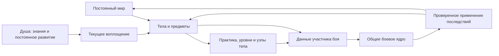

# SM2 — архитектура Души, тела и развития

**Принятые направления, 12 сентября 2026.** Полноценная анатомия становится будущим источником жизнеспособности тела; общая полоска здоровья — производное отображение. Физические места хранения (карманы, пояс, рюкзак), размер и масса предметов становятся целевой моделью инвентаря. Пошаговый бой и управляемый отряд сохранены. Конкретные структуры и первый объём реализации ещё проектируются; текущий P6.1 не изменён.

Архитектурное следствие для следующей проработки: жизненное состояние должно иметь один источник, чтобы органы и прежние HP не давали противоречащих друг другу исходов. Местоположение предмета в будущем определяется через его контейнер и владельца; перенос контейнера, смерть носителя и сохранение должны сохранять предметную идентичность. Детальные анатомические зависимости, вложенность контейнеров, ограничения веса/размера, адаптация лечения/протезов и совместимость сохранений остаются проектными вопросами. Возможность менять снаряжение в бою отдельно не согласована.

P6.1: Sm2RegionCatalog задаёт граф мест и привязки контента; Sm2RegionState хранит секунды, посещения и положение каждого тела. Компонент включается в прежний атомарный JourneyWorld, предметы определяют место через владельца, старые форматы неизменны. Время берётся из каталогов действий и маршрутов без часов ОС; история восстанавливает карту вместе с боем. [Контракт](IMPLEMENTATION_P6_1.md). Контрольные снимки и архивирование для большой кампании ещё не реализованы.

P5.5: пользователь выбрал кибернетический пси-усилитель с увеличенным расходом концентрации. Имплант усиливает эффективный Резонанс, работает вместе с генетикой, устанавливается вне боя и остаётся в прежнем теле. [Контракт](IMPLEMENTATION_P5_5.md), [приёмка](STATUS_P5_5.md). body_upgrades.2 расширяет закрытые операции через psionic_focus_cost. Sm2PsionicCostQuery общий для описания/прогноза/AI/исполнения; источник собственного XP остаётся отдельно. Schema17 и независимый слот сохраняют строгие прежние профили.

P5.4 — общая система улучшений тела и первая генетика «Усиленные мышцы». Препарат из конечного подготовленного тайника, применение только вне боя. Улучшение принадлежит телу; собственная практика и условия изучения узлов не подменяются. [Контракт](IMPLEMENTATION_P5_4.md), [приёмка](STATUS_P5_4.md). Каталог ограниченных операций отделён от состояния установленных улучшений и запаса препаратов. Бой получает неизменяемые улучшения из origin; общий расчёт характеристик отделён от заработанного опыта. Schema16 и отдельный слот сохраняют прежние контракты.

P5.3: согласован псионический щит на себя, конечное поглощение атак после брони, включая псионику; яд и внутренний урон проходят. До начала следующего хода, повтор обновляет без сложения. Отдельный узел тела, рост от Псионики/Резонанса, практика за применение. [Контракт](IMPLEMENTATION_P5_3.md), [приёмка](STATUS_P5_3.md). Sm2BarrierState хранит отдельный запас, Sm2BarrierRules считает поглощение до ограничения по текущим HP. Общие attack/spell/area запросы и исполнение согласованы; травмы/мораль получают фактическую потерю HP. Срок обрабатывается прежним TurnScheduler, загрузка его не запускает. Schema15 и новый слот сохраняют строгие прежние форматы.

P5.2 подключает общий Sm2AbilityParameterQuery к урону псионики. Определение хранит проверенные ссылки на направления, базовые уровни, дробные коэффициенты и предел. Расчёт использует живую прогрессию до текущего действия и возвращает отделённую расшифровку. Данные способности неизменны; preview/исполнение/AI/экран узла согласованы. Отдельные версии и schema14 сохраняют прежний P5.1. [Контракт](IMPLEMENTATION_P5_2.md).

P5.1: псионические способности описываются данными Sm2PsionicCatalog; доступ компилируется из узлов исходного героя для каждой встречи. Общие операции прямого урона и ресурса переиспользуются в schema13. Практика действия на общем кандидате, права и счётчики проверяются при загрузке. Новый профиль/слот сохраняет прежние миры; воплощение сбрасывает практику и доступ, мир и знания сохраняются. [Контракт](IMPLEMENTATION_P5_1.md).

P4.10: отделённая Sm2HeroDevelopmentView получает числа из ProgressRules и право покупки из world.check; сцена отображает эти данные, не дублирует правила. Кнопка привязана к контексту показанного состояния, поэтому устаревшее нажатие не может потратить опыт нового носителя. Слоты, каталоги и снимки прежние. [Контракт](IMPLEMENTATION_P4_10.md).

P4.9: каталог мест .3 ссылается на узлы прогрессии через required_nodes. Общий access_error проверяет практику текущего исполнителя; buy_node использует прежний атомарный путь. Party content .2 допускает узел без числовой прибавки. История сохраняет контекст прошлой жизни и не требует её узлов от нового тела после уже состоявшегося сбора. Старые профили остаются строгими. [Контракт](IMPLEMENTATION_P4_9.md).

P4.8: версия .2 каталога исследования явно связывает осмотр с направлениями проверенного каталога прогрессии. Sm2ProgressRules проверяет все награды до изменения кандидата. XP и находки публикуются общей командой; история воспроизводит награду в контексте исполнителя и воплощения. Новое направление проходит через существующие origin/schema12 и сбрасывается общим empty_body. Отдельные формат/слот сохраняют P4.7 без практики. [Контракт](IMPLEMENTATION_P4_8.md).

P4.7: Sm2ExplorationCatalog задаёт конечные источники, Sm2ExplorationState хранит признаки сбора и минуты. Общий кандидат Journey объединяет награду и отметку; история сверяет остаток с получением и расходом. CareCatalog .2 добавляет явный предел запасов без ослабления .1. Новое внешнее сохранение не меняет schema12 боя. [Контракт](IMPLEMENTATION_P4_7.md).

P4.6: Sm2CareCatalog содержит проверенные определения расходников и услуг, Sm2CareState — остатки и накопленные минуты процедур. Общая команда Journey публикует результат, расход и время атомарно; история загрузки сверяет их совместно. Новый внешний формат лагеря сохраняет прежнюю schema12 боя: восстановленный HP попадает в следующий origin, не в уже начатый бой. [Контракт](IMPLEMENTATION_P4_6.md).

P4.5: функция части, отсутствие естественной руки и ссылка на установленный протез разделены в Sm2BodyFunctionState .2. Sm2ProsthesisInventory хранит отдельные уникальные экземпляры; проверка мира сверяет обе стороны установки. Тот же запрос доступности используется оружием, щитом, реакциями, практикой и проекцией ИИ. Состояние устройства переносится с исходом боя и сохраняется у прежнего тела при смене воплощения. Новый профиль schema12 не меняет прежние схемы. [Реализованный контракт](IMPLEMENTATION_P4_5.md).

P4.4: состояние функций Sm2BodyFunctionState принадлежит Sm2WorldBody отдельно от прогрессии. Общий Sm2BodyCapabilityQuery связывает части с использованием экипировки. Проекция встречи и копия ИИ отделены; травма входит в общий боевой кандидат, лечение — в команды мира. Явная schema11 сохраняет строгие прежние схемы. [Реализованные границы](IMPLEMENTATION_P4_4.md).

Дополнение P4.3 (0.5.6-p4.3): в новом профиле герой использует полные направления, спутник — отдельное состояние Sm2CompanionProgress с одним XP и вычисляемыми уровнями/характеристиками. Общие команды боя, проекции и координатор мира работают с явными моделями; соответствие роли проверяется на границе сохранения и встречи. Восемь характеристик героя сохраняются в мире и сбрасываются при воплощении; полный набор их игровых применений ещё впереди. [Реализованный контракт](IMPLEMENTATION_P4_3.md).

Дополнение P4.2 (0.5.5-p4.2): лаборатория восьми характеристик использует общие правила опыта, покупки и сохранения P1 с отдельным профилем, форматом и слотом. Sm2PracticeCapability проверяет условия упражнения и локальную помощь учебного стенда; собственный уровень для покупки остаётся независимым. Контракт — [IMPLEMENTATION_P4_2.md](IMPLEMENTATION_P4_2.md). Локальные функции органов, общие импланты и подключение восьми характеристик к бою/новому воплощению этим не реализованы.

Дополнение 11 сентября 2026: реализован P4.1 (0.5.4-p4.1), отдельный ограниченный срез поверх P1–P3. Постоянные вещи и исходное развитие проецируются в общий бой через Sm2EncounterFactory и Sm2EncounterOrigin; отдельные версии снимков сохраняют строгий P2/P3. Текущие команды копируют текущую модель, не пересчитывая закрытые бои. Проверяемая история загрузки пока ограничена 4096 записями; хранение большой кампании потребует контрольных снимков и архивирования. Готовые контракты — [IMPLEMENTATION_P4_1.md](IMPLEMENTATION_P4_1.md), приёмка — [STATUS_P4_1.md](STATUS_P4_1.md). Нижеследующий проект всей игры не означает реализации всех перечисленных возможностей.

Дата: 10 сентября 2026 года. Статус: **проект полной архитектуры; ограниченные срезы P1–P3 реализованы по своим IMPLEMENTATION-документам**. Остальные возможности этого проекта пока не являются готовыми API.

Пользователь согласовал уточнение архитектуры и плана после обсуждения мира и опыта. Игровые правила, прямо выбранные пользователем, собраны в [WORLD_CONCEPT.md](WORLD_CONCEPT.md) и [DECISIONS.md](DECISIONS.md). Здесь предлагаются инженерные границы, данные и проверки для их реализации. Названия будущих классов, порядок подключения и технические сценарии — проект, а не уже существующие API или окончательные правила игры. Открытые вопросы нельзя закрывать неявным выбором значения в коде.

Общие принципы [ARCHITECTURE_PLAN.md](ARCHITECTURE_PLAN.md) сохраняются: один проект Godot на типизированном GDScript, ядро на RefCounted, определения отдельно от экземпляров, команды с атомарным результатом, общие запросы для UI и ИИ, явные версии сохранений. Исторический план наёмной компании заменён [DEVELOPMENT_ROADMAP.md](DEVELOPMENT_ROADMAP.md).

## 1. Что уже есть и что потребуется

Текущий прототип — M0–M4.4 + P1–P3, версия 0.5.3-p3. Приёмка — [STATUS_P3.md](STATUS_P3.md). P1 реализует Sm2SoulState, Sm2ProgressBodyState, Sm2IncarnationRecord, Sm2ProgressTrackState и координатор Sm2ProgressLab. P2 переиспользует расчёт направлений и покупок через Sm2ProgressRules, добавляет Sm2BattleDevelopment с двумя независимыми телами и привязками actor→body внутри кандидата Sm2TacticalBattle. Один Sm2CombatStatQuery используется прогнозом, атакой, реакцией и ИИ. Схема8 сохраняет бой и развитие вместе; replay изолирован. Sm2LifeWorld/Sm2LifeSession в P3 реализуют малый сохраняющийся мир и новое воплощение. Общая кампания и последующие встречи с исходной практикой ещё не подключены; контракт — IMPLEMENTATION_P3.md. Таблица ниже описывает прежнюю боевую основу и направления расширения; точные выполненные границы — [IMPLEMENTATION_P1.md](IMPLEMENTATION_P1.md) и [IMPLEMENTATION_P2.md](IMPLEMENTATION_P2.md).

| Область | Реализовано сейчас | Предлагаемое расширение |
|---|---|---|
| Бой | Гексы, очередь, атаки, последствия, эффекты, мана, области, ИИ | Подключить индивидуально развивающегося участника через общий источник параметров |
| Участник | Локальный actor_id, сторона, владелец, контролёр, loadout_id | Постоянный ID тела, отдельное воплощение и связь с участником конкретного боя |
| Характеристики | Базовые значения профиля + временные эффекты и мораль | Собственная практика, уровни, купленные узлы, объяснимые зависимости характеристик |
| Предметы | Экземпляры боя, фиксированные слоты weapon/shield/body/head | Постоянные предметы мира, перенос владения, затем анатомия и расширение экипировки |
| Смерть | HP0 означает смерть, удаление из очереди и очистку эффектов | Отдельный жизненный цикл тела и операция нового воплощения |
| Сохранение | Версионированный отдельный бой и локальный флаг выдачи исхода | Согласованное сохранение мира, Души, тел, развития и активного боя |
| Контент | Проверенные каталоги, стабильные ID и fingerprints | Каталоги направлений развития, узлов, знаний и правил начисления практики |

Готовность к новому контенту не означает, что достаточно добавить названия конечностей или узлов в существующий Resource. Новые операции требуют обработчика, валидации, прогнозирования, отображения и проверок.

## 2. Владение состоянием и идентичность

Предлагаемая структура содержит независимые идентичности. Число «боец №3» не определяет личность игрока или конкретное тело за пределами текущего боя.

| Сущность | Собственные данные | Связи |
|---|---|---|
| WorldState | Идентичность мира, время, места, жители, предметы и последствия | Реестр тел, тайники, активные встречи |
| SoulState | Идентичность Души, сохранённые знания, отдельное постоянное развитие | Текущее воплощение либо отсутствие носителя |
| BodyState | Тело, его состояние и компоненты; при активном воплощении — практическое развитие | Место в мире, экипировка, текущая ревизия |
| IncarnationRecord | Факт связи Души и тела, начало и завершение конкретного воплощения | soul_id, body_id, собственный incarnation_id |
| PartyState | Состав спутников и назначение управления | Ссылки на постоянных участников; Душа не подменяется отрядом |
| BattleParticipation | Локальный actor_id, привязка к постоянному телу, боевые ресурсы и состояние | battle_id, body_id, incarnation_id при наличии |
| WorldItemState | Постоянный экземпляр предмета, состояние, владелец или место | Явное соответствие временному item_id в бою |

Это роли данных, а не требование немедленно создать семь крупных классов со всеми будущими полями. В первом срезе вводятся лишь используемые поля. Связи хранятся по ID, без циклов сильных ссылок между RefCounted.

Постоянные IDs уникальны в пределах мира и не переиспользуются. Каждый новый бой и каждый самостоятельный источник практики получают собственный instance ID из сохраняемого аллокатора на кандидате той же команды; отказ не расходует ID. Авторский scenario_id обозначает повторяемый шаблон и не заменяет идентичность его запуска. Повтор одной встречи создаёт новый battle_id, тогда как actor_id/item_id внутри разных боёв могут совпадать. Это необходимо и для правильного применения подтверждений опыта и исходов.

Стрелки показывают обмен данными. Они не дают бою права напрямую менять произвольный объект мира. Прикладная сессия координирует переходы, доменные операции определяют их допустимость и последствия.

У спутников могут быть тело и контролёр игрока без привязки к Душе главного героя. Уточнение пользователя 11 сентября: полноценная практика направлений и покупка узлов предназначены только герою. У спутников/помощников общий опыт их развития, уровень и автоматические прибавки характеристик за уровень. Наследование знаний и общие правила смерти этим не определяются; сохранение развития живого спутника при смене воплощения героя уже принято.

### Две модели развития — проект подключения

Предлагается хранить у участника явный вид развития и соответствующее состояние, а общие параметры тела/экипировки и запросы доступных действий использовать независимо от этого вида.

| Участник | Исходное состояние развития | Как меняется | Что получает общее игровое ядро |
|---|---|---|---|
| Главный герой | Практика отдельных характеристик/навыков, расходы и освоенные узлы текущего тела | Соответствующие действия и покупки | Рассчитанные характеристики и доступные возможности |
| Спутник/помощник | Один накопленный опыт и ссылка на правила роста; уровень вычисляется по порогам | Награды общего опыта, автоматический рост при пересечении порогов | Те же виды рассчитанных характеристик и возможностей |

Технический способ ещё проектируется: профиль роста может задавать исходные значения и прибавки по уровням. Конкретные профили, равномерность роста, различия ролей и открытие способностей не утверждены. Не нужно хранить для спутника сотни пустых направлений героя или имитировать автоматический рост скрытыми покупками его узлов.

Предлагается получать уровень и постоянные прибавки из накопленного опыта и версии профиля, чтобы загрузка не начисляла прибавки второй раз. Повреждения, экипировка и временные эффекты остаются отдельными источниками состояния. Бой, прогноз, ИИ и UI читают общую проекцию, а не дублируют свои формулы для двух типов развития.

Награды героя и спутника должны публиковаться вместе с породившим их действием/исходом на одном кандидате. Источники и распределение общего опыта спутников пока открыты; общий канал событий не означает одинаковых наград или опыта за последний удар. При загрузке проверяется схема выбранного вида развития, версия профиля и соответствие исходным данным. Конкретный формат назначается в спецификации следующего среза; старые P2–P4.1 не ослабляются и не мигрируются автоматически.

## 3. Граница воплощения

Принято: допустим свежий труп чистого человека без улучшений; сознание и подготовка прежнего владельца не наследуются. Выбор носителя не должен давать готовые усиления. Знания Души переживают смену тела, практическое развитие начинается заново. Мир не пересоздаётся.

Уточнение 11 сентября: к развитию тела относятся все восемь характеристик — Мощь, Моторика, Стойкость, Интеллект, Восприятие, Воля, Резонанс и Синхронизация. Их развитие не переносится в следующее воплощение вместе со знаниями Души. Это уточняет владение будущим состоянием, но не задаёт стартовые значения, детальные функции характеристик или миграцию существующих направлений P1–P4.1.

Предлагаемая операция Embody принимает ссылку на тело из мира, ожидаемые ревизии и версию правил допустимости. Клиент не передаёт доверенное значение «подходит» и не назначает себе характеристики. Проверка принадлежности мира, смерти, человеческого происхождения, свежести, отсутствия улучшений и допустимости перехода выполняется ядром.

Успешная операция на одном кандидате создаёт новую запись воплощения, связывает Душу с носителем и инициализирует практическое развитие по стартовому определению. Старое воплощение и история мира остаются отдельными записями. ID и исторические ссылки на погибшее тело не переиспользуются как ID новой личности. Ошибка не меняет Душу, тело, предметы или счётчики.

**До реализации операции нужно определить:** как измеряется свежесть, какие повреждения допустимы и как устраняется причина смерти, как задаются стартовые физические значения, что происходит со снаряжением трупа и сколько проходит времени. Запрет наследования улучшений уже принят; точный алгоритм восстановления физиологии из него не следует. Пригодность собственного прежнего тела и возврат в восстановленное тело также не решены. Для проверки можно использовать явно описанную техническую фикстуру, которая не утверждает эти правила для кампании.

Предметы мира не следует молча удалять или дублировать при смене носителя. Постоянный тайник переживает смену тела; конкретная доступность его новому воплощению определяется миром. «Мир сохраняется» не обещает, что время, жители и предметы навсегда замерли.

## 4. Единый механизм опыта характеристик и навыков главного героя

Принятый контракт для каждого направления развития:

- Практика начисляет собственный опыт этого направления. Удар мечом может одновременно дать опыт силы и ближнего боя; это самостоятельные начисления.
- Накопленный опыт автоматически повышает уровень. Рост уровня не расходует опыт, предназначенный для покупки узлов.
- Узлы покупаются из доступного остатка соответствующего опыта. Потраченный опыт продолжает учитываться при определении уровня и продвижения к следующему.
- Опыт одного направления не превращается в универсальную валюту для другого. Стрельба из лука сама по себе не обучает псионике.

Предлагаемый общий тип ProgressTrackState применяется к характеристикам и навыкам главного героя. Различие между ними задаётся определением и зависимостями, без отдельного класса для каждой силы, медицины или профессии. Он не является обязательным полным состоянием упрощённой прогрессии спутника.

| Поле/значение | Источник |
|---|---|
| track_id | Стабильный ID направления в каталоге |
| earned_total | Накопленный опыт текущего воплощения, авторитетное состояние |
| spent_total | Опыт, израсходованный на узлы этого направления |
| available | Вычисляется как earned_total − spent_total |
| level | Вычисляется по earned_total и таблице порогов определения |
| owned_nodes | Купленные узлы и ранги, если ранги введены соответствующим этапом |

Инварианты: `0 <= spent_total <= earned_total`; доступный опыт неотрицателен; покупки не изменяют earned_total; повышение уровня не увеличивает spent_total. Направления не делят один общий баланс. Отмена покупки и возврат опыта пока не поддерживаются правилами, их нельзя добавлять неявно.

Расход дополнительно сверяется с покупками: в первом срезе сумма фиксированных цен купленных узлов/рангов по закреплённым правилам равна spent_total соответствующего направления. Стартовые узлы, если понадобятся в фикстуре, выдаются явным стартовым определением и отделяются от оплаченных; произвольная пометка узла «бесплатный» в save не принимается. Будущие переменные цены потребуют проверяемых записей покупок и отдельной политики совместимости. Одной проверки неотрицательного остатка недостаточно.

Для уровня L используется накопленный порог T(L) от начала развития направления. Пороги строго возрастают. Шкала текущего уровня выводится из earned_total и соседних порогов; её не обнуляют расходованием опыта на узлы. Уровень и остаток можно кешировать, но они не становятся вторыми независимо редактируемыми источниками истины.

**Технический пример, не баланс:** стартовая сила 10; порог силы 11 — 100 опыта, силы 12 — 250. При earned_total=120 и spent_total=0 сила равна 11, доступно 120, продвижение внутри уровня — 20 из 150. Покупка узла за 70 меняет только spent_total на 70: сила остаётся 11, доступно 50, продвижение остаётся 20 из 150. Следующие 30 опыта дают earned_total=150, доступно 80 и продвижение 50 из 150. Ближний бой имеет свой независимый учёт.

Узлы с постоянными практическими улучшениями принадлежат развитию текущего тела/воплощения. Знания Души хранятся отдельно. Знание рецепта само по себе не начисляет опыт медицины или возвращает купленные ранее практические узлы. Точные условия применения сохранённого знания новым телом ещё нужно определить.

## 5. Характеристики, уровни и возможности

Принято: сила растёт своим опытом и даёт прибавку к боевому навыку. Для реализации предлагается различать:

1. Собственный уровень направления, полученный его практикой.
2. Постоянные изменения от купленных узлов и компонентов тела.
3. Итоговое значение для конкретного действия с влиянием характеристик, экипировки, эффектов и ситуации.

Единый запрос должен объяснять вклад каждого источника. Повышение силы меняет вычисляемый вклад в ближний бой, но вычисленная прибавка сама не порождает новое начисление опыта. Практика приходит только из разрешённой деятельности. Это предотвращает рекурсивное начисление «сила улучшила бой, бой снова выдал опыт силы».

Зависимости расчёта образуют проверяемый направленный граф. Цикл вроде «итоговая сила зависит от итогового ближнего боя, который зависит от итоговой силы» отклоняется. Иные модели циклического расчёта не входят в первый срез. Для требований узлов явно задаётся, какое значение проверяется: собственный уровень, изученное знание или другая разрешённая величина. Пользователь подтвердил 11 сентября: усиления помогают выполнять действия, но не заменяют собственную практику для изучения узлов. Прибавки от компонентов тела, экипировки и временных эффектов нельзя выдавать за требуемое собственное развитие. Конкретные пороги и дополнительные условия изучения, а также требования применения способностей остаются открытыми.

Деревья должны уметь открывать новые действия и возможности: генетика, протезы и псионика позже меняют допустимые операции, а не только числовые бонусы. Сам обработчик нового действия всё равно реализуется кодом. Нет класса на каждую комбинацию «человек + имплант + псионик + профессия».

## 6. Каталоги, узлы и междисциплинарные связи

Предлагаемые определения: ProgressTrackDefinition, ProgressNodeDefinition, KnowledgeDefinition, PracticeRuleDefinition и правила вычисляемых вкладов. Для тела и улучшений позднее добавляются отдельные предметные определения. Resource остаётся авторским форматом, после проверки ядро получает типизированный каталог.

У определения узла раздельны идентичность, принадлежность направлению, требования, стоимость, эффект и данные отображения. Требование «медицина + псионика» не должно автоматически означать способ оплаты. Пользователь подтвердил важность сочетаний, но **оплата одного узла несколькими запасами опыта остаётся предложением**. В первом срезе достаточно узлов с ценой из одного собственного направления. Архитектура должна позволить позднее расширить описание цены с явной валидацией и версией правил.

Требования используют ограниченный набор типизированных условий: например, освоенный узел, собственный уровень, знание, возможность тела. Конкретный набор вводится вместе с проверками и различает изучение узла и применение способности: возможность тела может помогать выполнению, но не подменяет собственную практику для обучения. Дополнительные условия задаются отдельно. Контент не выполняет произвольные скрипты. Числовые бонусы и выдача уже реализованного действия — разные виды операции; новые виды нельзя маскировать строкой существующего эффекта.

Минимальная валидация каталога: уникальные ID, правильные типы ссылок, растущие пороги, корректные стоимости, доступность операций, отсутствие циклов обязательных предпосылок и вычислений, разрешимые междисциплинарные ссылки. Противоречивые условия должны иметь диагностику; проверка ссылок сама по себе не доказывает достижимость каждого узла.

Каталог правил общий и неизменяемый во время сессии. Изученные узлы, опыт и развитие тел не записываются в авторские Resource. Для каждого тела не создаётся копия полного каталога.

## 7. От действия к практике: одна транзакция

Будущий PracticeResolver получает факт выполненной деятельности и соответствующие правила начисления. Связи «действие → направления опыта» находятся в данных; коэффициенты, награда за промах, реакции, слишком слабую цель, повторение, обучение и небоевую деятельность остаются вопросами баланса до спецификации среза.

Факт практики содержит идентичность источника, участника/воплощения, ревизию и порядковый номер события, тип деятельности и версию правила начисления. UI не отправляет доверенное количество опыта. Preview, наведение, отказ команды, чтение сохранения и повторное отображение журнала не считаются практикой.

Предлагаемый порядок прикладной команды:

1. Проверить ревизии и действие; подготовить кандидата затронутого состояния.
2. Разрешить действие общими правилами; получить проверенные факты.
3. Начислить соответствующие запасы опыта, вычислить уровни и изменившиеся зависимости на том же кандидате.
4. Проверить целостность тела, развития и активного режима; зафиксировать подтверждение обработки фактов.
5. Опубликовать состояние и отделённые события для UI. Любая ошибка до публикации откатывает действие, опыт, покупки, ID и RNG вместе.

Прогрессия не должна быть необязательным подписчиком UI-сигнала после публикации боя: иначе ошибка её обработчика оставит состоявшийся удар без положенного изменения развития. Для подключения к существующему бою потребуется явная подготовка кандидата и общая точка публикации в прикладном слое. Вызывать execute на живом бою, а затем пытаться отдельно сохранить опыт нельзя считать общей транзакцией.

Покупка узла — отдельная команда: проверка требований и остатка → увеличение spent_total → запись узла → пересчёт затронутых значений → проверка → одна публикация. Недостаток опыта или повторная покупка одноразового узла оставляют весь снимок прежним.

## 8. Подключение индивидуальных характеристик к бою

В текущем коде loadout_id связывает не только четыре значения Sm2CombatStatQuery: от профиля также зависят максимум HP, AP, усталость, инициатива, мораль, мана, сопротивления и набор действий. Эти зависимости проверяются при загрузке снимка. Изменения одного запроса характеристик недостаточно.

Предлагается новый ResolvedParticipantBuild: отделённые данные конкретного участника с привязкой к телу/воплощению, ревизией источника, вычисленными базовыми характеристиками, возможностями и ссылками на экипировку. Он является состоянием экземпляра, а не новым каталогом контента. Общий провайдер параметров обслуживает разрешение действий, прогноз, ИИ, планировщик и валидацию снимка. Старые режимы используют адаптер прежних профилей без изменения их поведения.

Fingerprint каталога отвечает за версию авторских правил; ревизия тела и данные его развития — за конкретного героя. Нельзя менять fingerprint после каждого повышения силы или доверять любым присланным значениям только потому, что их hash совпал. При загрузке производные значения проверяются по сохранённым исходным данным и закреплённым правилам; кеши пересоздаются.

На время боя затронутые тела и предметы резервируются в постоянном мире. Активная сессия владеет их рабочими изменениями; внешняя деятельность не редактирует те же записи параллельно. Резервированная исходная запись мира служит основанием, а не вторым актуальным состоянием. Сохранение включает рабочие данные и связи. Завершение или выход из режима публикует накопленные изменения в постоянные записи одной операцией. Для большой кампании копируются затронутые агрегаты, а не весь мир на каждый удар; существующий небольшой BattleState пока сохраняет собственную проверенную модель копирования.

Запросы к зарезервированным телам и предметам читают актуальное рабочее состояние через тот же прикладной источник. Они не показывают прежнее здоровье или старый опыт из исходной записи мира. Возвращение из боя включает закрытие этой резервации в ту же транзакцию.

**Требует отдельного решения перед боевым подключением:** когда новый уровень начинает влиять на текущий бой, можно ли покупать узлы в бою, как меняются текущие ресурсы при изменении максимума. Рекомендуемое техническое начало — обновлять разрешённые значения между полностью завершёнными командами, сохраняя очередь текущего раунда и её якоря. Это рекомендация, не утверждённое новое правило инициативы. Первыми можно подключить силу и ближний бой, оставив изменения максимумов ресурсов следующему срезу.

## 9. Сохранения, повтор и применение исхода

Расширение получает отдельный формат сессии, новый боевой ruleset при подключении к бою и собственный слот. Точные идентификаторы назначаются в спецификации реализации. Schema7/sm2.m4.areas.1 и старые слоты остаются прежними; данная документация не объявляет их совместимыми с Душой и прогрессией.

Снимок будущей сессии содержит мир и ревизии затронутых записей, Душу, воплощения, исходные данные прогрессии, владение предметами, активный бой с привязками и подтверждения применения результатов. Каталоги и версии правил закреплены явно. Уровни/остатки/сборки проверяются, а не подменяются молчаливым исправлением. Большие счётчики и ID сохраняются с точным представлением по прежнему принципу строковых целых.

Декодер проверяет согласованность spent_total с оплаченными узлами и закреплёнными ценами/записями покупок. Узел без предусмотренной оплаты или расход без основания отклоняет весь кандидат. Проверяются также аллокаторы идентичностей и ссылки на уникальные экземпляры источников; повторяемый scenario_id не признаётся подтверждением уже применённого нового боя.

Загрузка восстанавливает устойчивое состояние без выполнения деятельности. Применённые факты практики имеют сохраняемый упорядоченный курсор/подтверждение в пределах своего источника; повторный факт не начисляет опыт. Курсор продвигается атомарно с изменением опыта. Не нужен бесконечный глобальный список всех нажатий за годы игры: завершённые источники сворачиваются в подтверждённый результат по явному протоколу.

Возврат исхода боя использует постоянное подтверждение по battle_id и данным результата. Тот же исход второй раз ничего не выдаёт; другой результат с уже применённым battle_id отклоняется. Нынешний result_recorded в Sm2TacticalSession защищает только локальную сессию и не является готовой транзакцией кампании.

Replay запускается на отдельном снимке с отдельным хранилищем. Он может повторно вычислять практику внутри своей копии для проверки воспроизводимости, но не меняет настоящую кампанию. Подписчики общего журнала не раздают награды в живой мир. Снимок остаётся основным сохранением; восстановление всей истории жизней через многолетний replay не требуется.

Изменение порогов уровня или цены узлов — изменение правил, требующее политики совместимости. Запись новых чисел в старый каталог не должна незаметно снижать уровень сохранённого героя. Первая миграция определяется отдельной задачей; старые игровые слоты не мигрируются автоматически.

## 10. Мир, анатомия и источники способностей

Технологические возможности описываются у мест, сообществ и инфраструктуры. Единая глобальная «текущая эпоха» не соответствует принятому миру. Причины изоляции, доступ к чужим технологиям, снабжение и реакция общества пока открыты. Один условный уровень развития может быть полезен для сортировки контента, но не заменяет конкретные возможности.

Генетика, кибернетика и псионика подключаются как разные источники возможностей, ограничений и изменений характеристик. Пользователь подтвердил возможность успешно совместить все три пути в одном персонаже и выбрал конкретные преодолимые побочные эффекты без обязательной постепенной утраты человеческих качеств. Конкретные пределы совместимости отдельных улучшений, цены, эффекты и способы их преодоления не определены. Сверхъестественные способности относятся к псионике. Старые mana/arcane и названия M4 остаются технической историей; переименование идентификаторов, ресурсов и правил восстановления требует отдельного среза совместимости.

Потеря конечности и протезирование требуют модели функций частей тела и совместимости оборудования. Нельзя объявить анатомию реализованной добавлением строки «рука» в нынешний каталог head/body. До изменения модели смерти текущий общий HP остаётся источником факта смерти для старых боёв. Кровь, жизненно важные органы, реанимация, многорукие тела и конкретные формулы не утверждены этим проектом.

Теоретическая возможность освоить все навыки не решает, можно ли одновременно применять все способности или устанавливать любые сочетания улучшений. Ограничения активных комбинаций остаются отдельным вопросом и не вводятся скрыто через дерево несовместимых классов.

## 11. Масштаб контента и инструменты автора

С первого набора нужны стабильные ID, понятные сообщения об ошибках, объяснение источников значения и поиск зависимостей. На следующем масштабе нужны импорт табличных данных, проверка недостижимых узлов и просмотр междисциплинарных связей. Источник каждого параметра один: импортированный файл не становится второй независимо редактируемой копией.

Предлагаемые меры: индекс «тип деятельности → правила практики», обратный индекс зависимостей, пересчёт затронутых значений, компактное хранение освоенных узлов и поиск без обхода всего каталога на каждый удар. В интерфейсе дерева рисуются видимые узлы; полный каталог не обязан порождать по активному Control на каждый узел.

Нагрузочные сценарии плана: 1 000 и 10 000 узлов; затем отдельное измерение 100 000 узлов и сотен направлений. Измерять загрузку/валидацию, память, начисление опыта, покупку, пересчёт зависимостей, сохранение и навигацию дерева. Это будущие проверки, не обещание производительности и не новые пределы формата. Скорость большого контента и скорость ИИ больших армий проверяются отдельно.

## 12. Критерии проверки будущей реализации

| Проверка | Требуемое наблюдение |
|---|---|
| Раздельная практика | Удар мечом даёт заданный опыт силы и ближнего боя; псионика неизменна |
| Автоматический рост | Порог и переход через несколько порогов дают правильные уровни и остаток шкалы |
| Покупка | Баланс уменьшается, уровень и продвижение остаются; чужой запас не используется |
| Отказ | Неверный узел, недостаток опыта и ошибка поздней проверки не меняют снимок/ID/RNG |
| Производные значения | Изменение силы объяснимо влияет на бой и не порождает новый опыт |
| Повтор и загрузка | Следующая команда совпадает; повторный факт/исход не дублирует развитие и вещи |
| Новое воплощение | Знания Души и мир сохраняются, практика и практические узлы нового воплощения стартовые |
| Допустимость носителя | Улучшенный или иной запрещённый носитель отвергается без изменений |
| Привязки | Одинаковые локальные actor_id разных боёв не смешивают тела или предметы |
| Старые режимы | Прежние версии, сохранения и формулы проходят собственную регрессию |

Сначала проверяется чистый импорт и ядро, затем отдельный UI и реальный запуск. Тестовые данные, runtime, логи и отчёты остаются в E:\GPT\SM2. Массовый контент создаётся после доказательства этой цепочки на малом наборе. Последовательность срезов и открытые решения — в [DEVELOPMENT_ROADMAP.md](DEVELOPMENT_ROADMAP.md).
